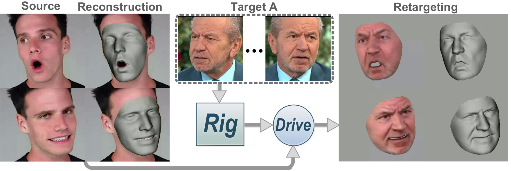

# Riggable 3D Face Reconstruction via In-Network Optimization
Source code for CVPR 2021 paper "Riggable 3D Face Reconstruction via In-Network Optimization".

[[paper]](https://openaccess.thecvf.com/content/CVPR2021/papers/Bai_Riggable_3D_Face_Reconstruction_via_In-Network_Optimization_CVPR_2021_paper.pdf) 
[[supp]](https://openaccess.thecvf.com/content/CVPR2021/supplemental/Bai_Riggable_3D_Face_CVPR_2021_supplemental.pdf) 
[[arXiv]](https://arxiv.org/abs/2104.03493) 
[[presen_video]](https://www.youtube.com/watch?v=tDwmstWZTWA)
[[supp_video]](https://www.youtube.com/watch?v=vs7Kyv5rGas).



## Installation

(1) Create an Anaconda environment.

```bash
conda env create -f env.yaml
conda activate INORig
```

(2) Clone the repository and install dependencies.

```bash
git clone https://github.com/zqbai-jeremy/INORig.git
cd INORig
pip install -r requirements_pip.txt
```

(3) Setup 3DMM

- Clone [this repository](https://github.com/zqbai-jeremy/face3d.git), which is forked and modified from 
[YadiraF/face3d](https://github.com/YadiraF/face3d.git), to "\<INORig directory\>/external/".

```bash
mkdir external
cd external
git clone https://github.com/zqbai-jeremy/face3d.git
cd face3d
```

- Setup face3d as in [YadiraF/face3d](https://github.com/YadiraF/face3d#getting-started).

- Download "Exp_Pca.bin" from [Guo et al.](https://github.com/Juyong/3DFace) (in "CoarseData" link of their repository)
and copy to "\<INORig directory\>/external/face3d/examples/Data/BFM/Out/".

- Download "std_exp.txt" from [Deng et al.](https://github.com/microsoft/Deep3DFaceReconstruction/blob/master/BFM/std_exp.txt)
and copy to "\<INORig directory\>/external/face3d/examples/Data/BFM/Out/".


(5) Download pre-trained model (Due to the sensitivity of face swapping, please email ziqian_bai@sfu.ca to request for 
the models. Please use your institution email. Sorry for the inconvenience and thank you for your understanding!) to "\<INORig directory\>/net_weights/". 
Need to create the folder. Unzip to get .pth files. "Ours.pth" is 
the basic version. "Ours(R).pth" is a more robust while less accurate version. Experiments in the paper are performed 
with these models.

## Run Demo

- Modify directory paths in demo.py and run

```bash
cd <INORig_directory>
python demo.py
```

- Variables:

    - rig_img_dir: Folder contains images to build the rig.
    
    - src_vid_path: Video path to drive the rig.
    
    - out_dir: Folder for outputs. Reconstructions of images are in "<out_dir\>/mesh" and "<out_dir\>/visualization". 
    Video reconstruction and retargeting are in "<out_dir\>/videos".

- The example video clip "\<INORig directory\>/examples/videos/clip1.mp4" is from 
[https://www.youtube.com/watch?v=ikAfrKf5A8I](https://www.youtube.com/watch?v=ikAfrKf5A8I)

[//]: # (## Training)

[//]: # (- Training requires 256x256 images with ground truth 3D scans. Loss functions and training parameters are provided in "\<DFNRMVS directory\>/train/losses.py")

[//]: # "- Need to setup [torch-batch-svd](https://github.com/KinglittleQ/torch-batch-svd) to use the losses."

## Acknowledge

- Thank Ayush Tewari, Soubhik Sanyal and Jiaxiang Shang for helping the evaluations!

- Thank for the helpful tools from [YadiraF/face3d](https://github.com/YadiraF/face3d)!

## Citation

```
@InProceedings{Bai_2021_CVPR,
    author    = {Bai, Ziqian and Cui, Zhaopeng and Liu, Xiaoming and Tan, Ping},
    title     = {Riggable 3D Face Reconstruction via In-Network Optimization},
    booktitle = {Proceedings of the IEEE/CVF Conference on Computer Vision and Pattern Recognition (CVPR)},
    month     = {June},
    year      = {2021},
    pages     = {6216-6225}
}
```
